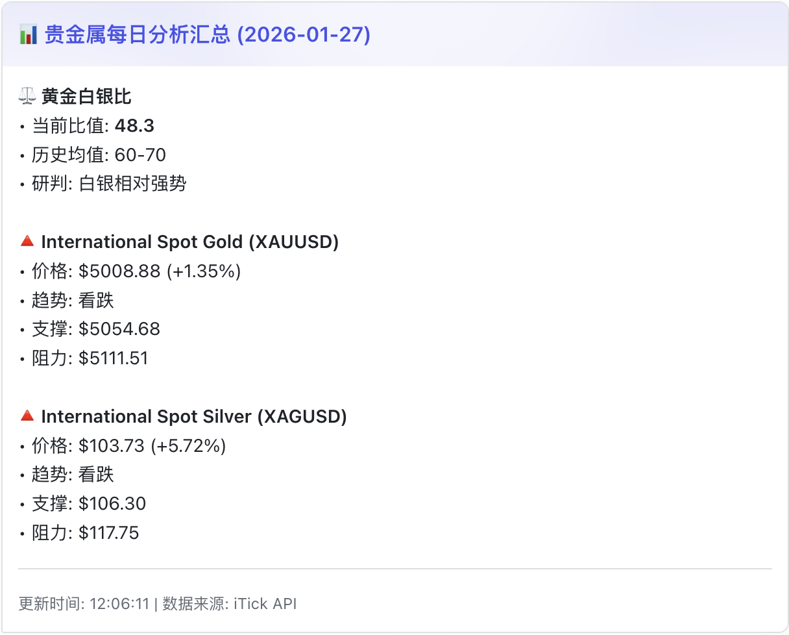
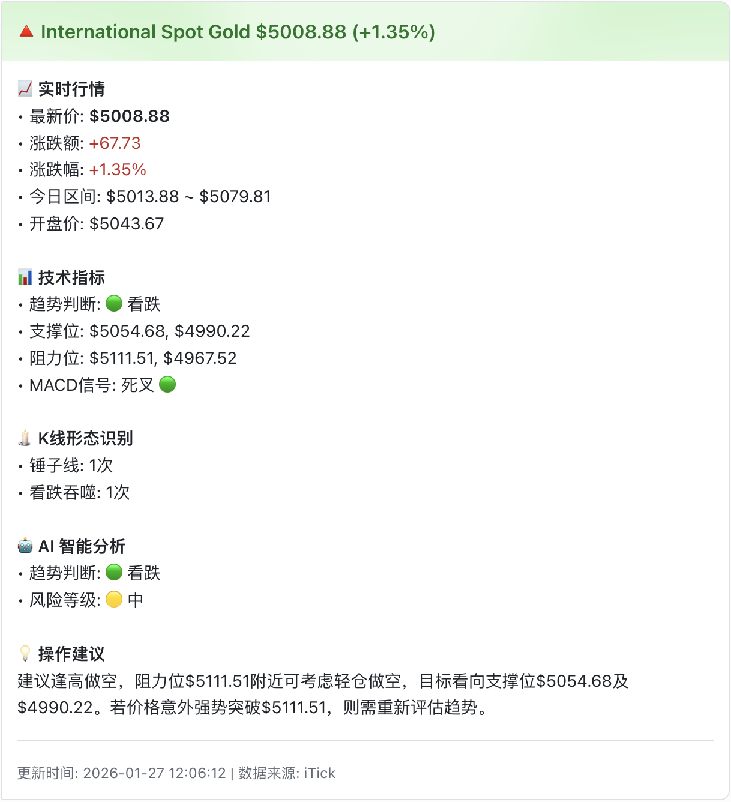

<div align="center">
  <h1>🤖 MetalTrend AI - 智能贵金属趋势分析系统</h1>
  <p>
    <strong>基于 AI 的自动化贵金属（黄金/白银）市场分析工具，集成 LLM 与专业技术指标，助您洞察先机。</strong>
  </p>
  <p>
    <a href="README.md">简体中文</a> | <a href="README_EN.md">English</a>
  </p>
  <p>
    <a href="https://www.python.org/"></a>
    <a href="LICENSE"></a>
    <a href="https://github.com/qubyyang/metal_trend_analysis/stargazers"></a>
    <a href="https://github.com/qubyyang/metal_trend_analysis/network/members"></a>
    
    
  </p>
</div>

---

**贵金属趋势分析机器人** 是一个功能强大的 Python 工具，它整合了实时市场数据、经典技术分析以及先进的大语言模型（LLM）智能，为您提供全面、深入的黄金和白银市场洞察。分析结果将以结构化报告的形式生成，并可实时推送到飞书，让您随时随地掌握市场动态。

## 🌟 项目特色

- **🤖 AI驱动分析**: 集成GPT-4等大语言模型，生成专业市场研判和自然语言报告
- **📊 专业技术分析**: 自动计算MA、MACD、RSI、布林带等关键技术指标
- **📡 实时数据**: 对接iTick API，毫秒级行情更新，确保数据实时性
- **📰 新闻情感分析**: 集成Bloomberg、CNBC、凤凰网财经等新闻源，智能分析市场情绪
- **🕯️ K线形态识别**: 智能识别十多种经典K线形态（十字星、锤子线、吞噬形态等）
- **📱 多渠道推送**: 支持飞书、邮件等多种通知方式，确保信息及时触达
- **⚙️ 高度可配置**: YAML配置文件，灵活定制分析参数和模型选择
- **🎯 智能趋势研判**: 结合技术面与基本面分析，自动判断市场趋势（看涨/看跌/震荡）
- **📍 关键位识别**: 自动计算并标识重要的支撑位和阻力位

## 成果展示

下面是机器人自动生成并推送到飞书的分析报告截图：

| 每日摘要报告 (Daily Summary) | 单一品种详情报告 (Detailed Report) |
| :--------------------------: | :----------------------------: |
|  |  |

## 🚀 快速开始

### Python虚拟环境安装

```bash
# 1. 克隆仓库
git clone https://github.com/qubyyang/metal_trend_analysis.git
cd metal_trend_analysis

# 2. 创建虚拟环境
python -m venv venv
source venv/bin/activate  # macOS/Linux
# venv\Scripts\activate   # Windows

# 3. 安装依赖
pip install -r requirements.txt

# 4. 运行分析
python src/main.py
```

---

## 📋 详细安装步骤

### 1. 环境准备

- Python 3.10 或更高版本
- Git

### 2. 安装

```bash
# 1. 克隆仓库
git clone https://github.com/qubyyang/metal_trend_analysis.git
cd metal_trend_analysis

# 2. (推荐) 创建并激活虚拟环境
python -m venv venv
source venv/bin/activate  # macOS/Linux
# venv\Scripts\activate   # Windows

# 3. 安装依赖
pip install -r requirements.txt
```

### 3. 配置

```bash
# 1. 复制配置文件
cp config/config.yaml.example config/config.yaml

# 2. 编辑配置文件 config/config.yaml
#    填入您的 API Keys 和 Webhook URL
```

您需要配置以下关键信息：
- `itick.token`: iTick API 的访问令牌
- `llm.api_key`: 您选择的大语言模型提供商的 API Key
- `llm.base_url` (可选): 如果您使用代理或私有部署的 LLM，请配置此项
- `llm.model`: 指定要使用的模型名称，例如 `gpt-4-turbo`
- `feishu.webhook_url`: 飞书机器人的 Webhook 地址
- `news.sources`: 新闻源配置（已包含Bloomberg、CNBC、凤凰网财经等已验证源）

### 4. 运行分析

```bash
# 运行对所有已配置品种的分析
python src/main.py

# 仅分析黄金
python src/main.py --instrument gold

# 仅分析白银，并指定时间周期为 1 小时
python src/main.py --instrument silver --timeframe 1h
```

分析完成后，报告将保存在 `output/reports/` 目录下，同时会推送到您配置的飞书频道。

## 📰 新闻情感分析功能

MetalTrend AI现在集成了强大的新闻情感分析功能，可以从多个权威新闻源抓取相关新闻，并自动分析市场情绪。

### 🏢 支持的新闻源

目前系统内置以下已验证可用的新闻源：

#### 英文新闻源
- **Bloomberg Markets** - 全球领先的商业和金融市场信息提供商
- **CNBC Market News** - 美国商业新闻权威机构

#### 中文新闻源  
- **凤凰网财经** - 知名中文财经媒体

### 🔧 工作原理

1. **新闻抓取**：系统从配置的RSS源定时抓取最新新闻
2. **关键词过滤**：根据`config/keywords.txt`中的关键词筛选相关新闻
3. **情感分析**：使用内置的情感词典分析每篇新闻的积极/消极词汇
4. **综合研判**：结合技术面分析，提供全面的市场洞察

### ⚙️ 配置说明

在`config/config.yaml`中，您可以配置以下新闻相关选项：

```yaml
news:
  enabled: true  # 启用新闻抓取
  max_articles: 10  # 每个源最多抓取的文章数
  cache_duration: 300  # 缓存时长（秒，5分钟）
  fetch:
    timeout: 15
    delay: 2  # 不同源之间的请求延迟（秒）
    max_retries: 3
  sources:
    # 可根据需要启用或禁用不同新闻源
    - name: "Bloomberg Markets"
      type: "rss"
      url: "https://feeds.bloomberg.com/markets/news.rss"
      enabled: true
    # ... 其他新闻源配置
```

### 📊 分析报告集成

新闻情感分析结果会集成到最终的Markdown报告中：
- **新闻情感统计**：显示整体市场情绪倾向
- **关键主题识别**：提取高频的积极/消极词汇
- **代表性文章**：展示最具影响力的新闻
- **LLM深度分析**：结合新闻内容提供专业的市场研判

## 📁 项目结构

```
metal_trend_analysis/
├── config/                # 配置文件
│   ├── config.yaml        # 主配置文件
│   └── keywords.txt       # (暂未使用) 新闻关键词
├── data/                  # 原始数据和缓存
├── docs/                  # 项目文档
├── images/                # README 和报告中使用的图片
├── output/                # 程序输出
│   ├── logs/              # 日志文件
│   └── reports/           # 生成的 Markdown 报告
├── src/                   # 核心源代码
│   ├── main.py            # 🚀 主程序入口
│   ├── analyzers/         # 📊 分析模块 (技术指标, K线形态, 新闻情感分析)
│   ├── data_fetchers/     # 📡 数据获取模块 (iTick, 新闻抓取)
│   ├── llm/               # 🤖 LLM 分析模块
│   ├── notification/      # 📢 通知模块 (飞书)
│   ├── reporting/         # 📄 报告生成模块
│   └── utils/             # 🛠️ 工具类 (配置加载, 日志)
├── .github/               # GitHub 配置
│   ├── workflows/         # GitHub Actions
│   └── ISSUE_TEMPLATE/    # Issue 模板
├── examples/              # 示例代码
├── tests/                 # 单元测试
├── .gitignore
├── LICENSE
├── README.md              # 本文档
├── README_EN.md           # 英文文档
└── requirements.txt       # Python 依赖
```

## 🏗️ 系统架构

MetalTrend AI 采用模块化架构设计，各组件职责清晰，易于扩展和维护。

### 核心模块说明

1. **数据获取模块** (`data_fetchers/`)
   - 对接iTick API获取实时行情数据
   - 支持多种时间周期的K线数据
   - 内置数据缓存机制，减少API调用

2. **分析引擎** (`analyzers/`)
   - 技术指标计算（MA、MACD、RSI、布林带等）
   - K线形态识别（十字星、锤子线、吞噬形态等）
   - 新闻情感分析（市场情绪量化评估）
   - 趋势研判和关键位识别

3. **LLM分析模块** (`llm/`)
   - 集成GPT系列大语言模型
   - 生成自然语言市场分析报告
   - 支持自定义prompt和模型选择

4. **报告生成** (`reporting/`)
   - 自动生成Markdown格式报告
   - 包含图表、指标表格和AI分析结论
   - 支持多种输出格式

5. **通知系统** (`notification/`)
   - 飞书机器人集成
   - 邮件通知（即将支持）
   - 推送失败重试机制

## 🗺️ 发展路线图

### ✅ 已完成 - v1.0
- [x] iTick API数据获取
- [x] 技术指标计算（MA、MACD、RSI、布林带）
- [x] K线形态识别（10+种经典形态）
- [x] LLM分析集成（GPT-4支持）
- [x] 自动报告生成（Markdown格式）
- [x] 飞书通知功能
- [x] 新闻抓取与情感分析（集成Bloomberg、CNBC、凤凰网财经等已验证源）

### 🚧 进行中 - v1.1
- [ ] Docker一键部署
- [ ] 配置向导
- [ ] 错误处理优化
- [ ] 单元测试覆盖
- [ ] CI/CD流程

### 📅 计划中 - v1.2
- [ ] Web界面（Streamlit）
- [ ] 更多技术指标（KDJ、OBV等）
- [ ] 自定义交易策略支持
- [ ] 历史数据回测功能
- [ ] 邮件通知支持

### 🎯 未来规划 - v2.0
- [ ] 机器学习模型集成
- [ ] 多交易所数据支持
- [ ] 移动端APP
- [ ] 社区策略分享平台
- [ ] 实时交易信号推送

---

## 📊 技术栈

| 类别 | 技术 |
|------|------|
| **语言** | Python 3.10+ |
| **数据处理** | Pandas, NumPy |
| **机器学习** | OpenAI API, LangChain |
| **技术分析** | TA-Lib, Pandas TA |
| **可视化** | Matplotlib, Plotly |
| **API** | iTick API, Feishu API |

---

## 🤝 贡献指南

我们热烈欢迎任何形式的贡献！无论是功能建议、代码优化、Bug 修复还是文档改进，都对我们至关重要。

### 如何贡献

1. **Fork 本仓库**
2. **创建特性分支** (`git checkout -b feature/AmazingFeature`)
3. **提交更改** (`git commit -m 'Add some AmazingFeature'`)
4. **推送分支** (`git push origin feature/AmazingFeature`)
5. **开启 Pull Request**

请参考 [CONTRIBUTING.md](CONTRIBUTING.md) 了解详细的贡献流程和代码规范。

## 📄 开源许可

本项目基于 [MIT License](LICENSE) 开源。

---

## 📚 相关资源

- [项目文档](docs/)
- [示例代码](examples/)
- [API文档](docs/api/)
- [常见问题](docs/faq.md)

## 🌟 社区与支持

- **GitHub Issues**: 报告Bug或提出新功能
- **GitHub Discussions**: 技术讨论和问答
- **Discord社区**: 即时交流和分享（即将推出）

---

## 🏷️ 相关标签

```
gold, silver, trading, technical-analysis, llm, gpt,
precious-metals, quantitative-finance, ai, python,
trend-analysis, market-analysis, algorithmic-trading,
chatgpt, open-source, fin-tech
```

---

## ⚠️ 免责声明

本工具提供的所有分析、数据和报告仅供学习和研究使用，不构成任何投资建议。金融市场存在风险，任何基于本工具信息进行的投资决策，风险自负。

---

<div align="center">
  <h3>🙏 如果这个项目对您有帮助，请给一个 ⭐️ Star！</h3>
  <p>您的支持是我们持续优化的动力 💪</p>
  <p>
    <a href="https://github.com/qubyyang/metal_trend_analysis">
      
    </a>
  </p>
</div>
