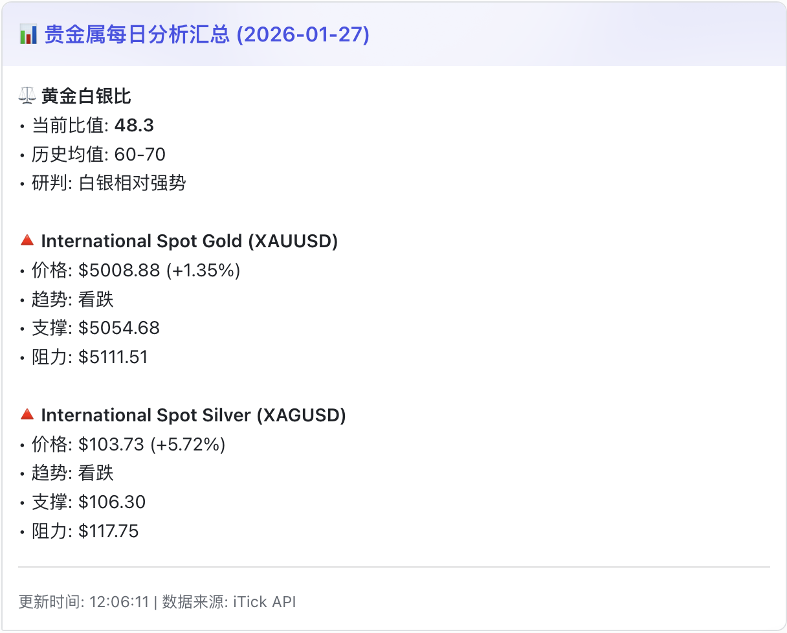
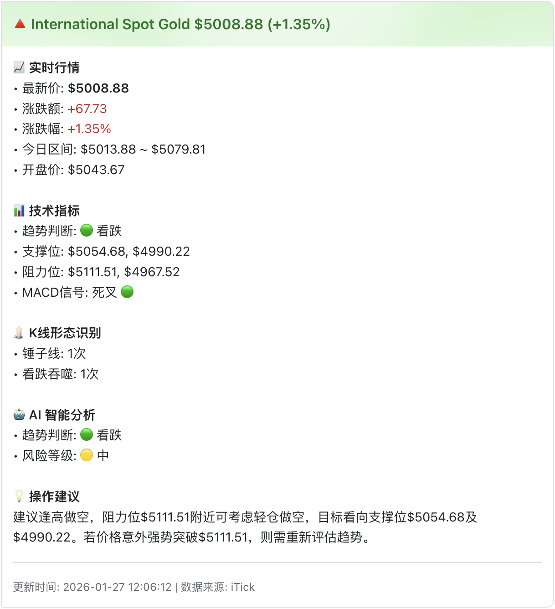

<div align="center">
  <h1>🤖 MetalTrend AI - Intelligent Precious Metals Trend Analysis System</h1>
  <p>
    <strong>AI-powered automated precious metals (gold/silver) market analysis tool, integrating LLM and professional technical indicators to help you seize opportunities.</strong>
  </p>
  <p>
    <a href="README.md">简体中文</a> | <a href="README_EN.md">English</a>
  </p>
  <p>
    <a href="https://www.python.org/"></a>
    <a href="LICENSE"></a>
    <a href="https://github.com/qubyyang/metal_trend_analysis/stargazers"></a>
    <a href="https://github.com/qubyyang/metal_trend_analysis/network/members"></a>
    
    
  </p>
</div>

---

**MetalTrend AI** is a powerful Python tool that integrates real-time market data, classical technical analysis, and advanced Large Language Model (LLM) intelligence to provide comprehensive, in-depth insights into gold and silver markets. Analysis results are generated as structured reports and can be pushed to Feishu in real-time, allowing you to stay informed about market dynamics anytime, anywhere.

## 🌟 Key Features

- **🤖 AI-Driven Analysis**: Integrates GPT-4 and other large language models to generate professional market analysis and natural language reports
- **📊 Professional Technical Analysis**: Automatically calculates key technical indicators including MA, MACD, RSI, Bollinger Bands, ATR, and more
- **📡 Multi-Source Market Data**: Sina Finance as primary with Stooq / Yahoo Finance failover, plus local cache fallback for resilience
- **📈 Technical Chart Generation**: Renders candlestick + MA + Bollinger Bands + support/resistance + MACD + RSI composite charts
- **🎯 Signal Accuracy Backtesting**: Persists every trend call and verifies it against actual prices, reporting win rate, profit factor and expectancy
- **📰 News Sentiment Analysis**: Integrates Bloomberg, CNBC, Phoenix Finance and other news sources for intelligent market sentiment analysis
- **🕯️ Candlestick Pattern Recognition**: Intelligently identifies 10+ classic candlestick patterns (Doji, Hammer, Engulfing, etc.)
- **📱 Multi-Channel Notifications**: Supports Feishu, DingTalk, Slack, Telegram, and Email. Channels auto-enable based on environment variables
- **⚙️ Highly Configurable**: All parameters (API keys, model selection, notification channels, etc.) are configured via YAML files for flexibility
- **📍 Key Level Identification**: Automatically calculates and identifies important support and resistance levels
- **✅ Tested & CI-Backed**: Full unit test suite with GitHub Actions matrix validation

---

## 📸 Showcase

Below are screenshots of analysis reports automatically generated and pushed to Feishu:

| Daily Summary Report | Detailed Single Instrument Report |
| :------------------: | :-------------------------------: |
|  |  |

---

## 🚀 Quick Start

### Python Virtual Environment Installation

```bash
# 1. Clone the repository
git clone https://github.com/qubyyang/metal_trend_analysis.git
cd metal_trend_analysis

# 2. Create virtual environment
python -m venv venv
source venv/bin/activate  # macOS/Linux
# venv\Scripts\activate   # Windows

# 3. Install dependencies
pip install -r requirements.txt

# 4. Copy environment file
cp .env.example .env

# 5. Run analysis
python src/main.py
```

---

## 📋 Detailed Installation Steps

### 1. Prerequisites

- Python 3.10 or higher
- Git

### 2. Install

```bash
# 1. Clone the repository
git clone https://github.com/qubyyang/metal_trend_analysis.git
cd metal_trend_analysis

# 2. (Recommended) Create and activate virtual environment
python -m venv venv
source venv/bin/activate  # macOS/Linux
# venv\Scripts\activate   # Windows

# 3. Install dependencies
pip install -r requirements.txt
```

### 3. Configuration

```bash
# 1. Copy configuration file
cp config/config.yaml.example config/config.yaml

# 2. Edit config/config.yaml
#    Fill in your API Keys and Webhook URL

# 3. Edit .env and fill in environment variables
#    e.g., LLM_API_KEY

# 4. (Optional) Install visualization dependencies if you need charts
# pip install matplotlib plotly
```

You need to configure the following key information:
- `api.stooq`: Stooq data source settings (no API key required)
- `llm.api_key`: Your LLM provider's API key
- `llm.base_url` (optional): Configure this if you use a proxy or self-hosted LLM
- `llm.model`: Specify the model name, e.g., `gpt-4-turbo`
- `feishu.webhook_url`: Feishu bot webhook URL
- `dingtalk.webhook_url`: DingTalk bot webhook URL (optional)
- `slack.webhook_url`: Slack webhook URL (optional)
- `telegram.bot_token` / `telegram.chat_id`: Telegram bot credentials (optional)
- `email.from` / `email.password` / `email.to`: Email notification credentials (optional)
- `news.sources`: News source configuration (includes verified sources: Bloomberg, CNBC, Phoenix Finance, etc.)

Example `.env` (for reference only, never commit real secrets):

```env
LLM_API_KEY=your_llm_api_key
LLM_MODEL_NAME=gpt-4o
FEISHU_WEBHOOK_URL=https://open.feishu.cn/open-apis/bot/v2/hook/xxx
```

### 4. Run Analysis

```bash
# Run analysis on all configured instruments
python src/main.py

# Analyze only gold
python src/main.py --instrument gold

# Analyze only silver with weekly timeframe
python src/main.py --instrument silver --timeframe 1w

# Skip chart generation for faster runs
python src/main.py --no-chart

# Backtest historical signal accuracy only
python src/main.py --backtest
```

After analysis is complete, reports are saved in `output/reports/`, charts in `output/charts/`, and pushed to your configured notification channels.

## 📡 Multi-Source Data & Failover

The system tries each data source in priority order, degrading automatically on failure:

```
Sina Finance (primary) → Stooq → Yahoo Finance → local cache → stale cache fallback
```

Measured source availability (Sept 2026):

| Source | Status | Notes |
|--------|--------|-------|
| Sina Finance | ✅ Available | Stable direct access, no auth required, **recommended primary** |
| Stooq | ⚠️ Restricted | Now serves a JS anti-bot challenge page instead of CSV |
| Yahoo Finance | ⚠️ Restricted | Returns 403 in some regions |

Configure in `config/config.yaml`:

```yaml
market_data:
  providers: ["sina", "stooq", "yahoo"]   # source priority
  cache_enabled: true
  cache_ttl: 3600                         # cache lifetime in seconds
  allow_stale_cache: true                 # use expired cache when all sources fail
```

The `source` field in quote data indicates which provider actually served the request.

## 🎯 Signal Accuracy Backtesting

Every trend call is persisted (technical and LLM tracked separately). Once the
holding period elapses, the call is verified against actual prices:

```bash
python src/main.py --backtest
```

Sample output:

```
- Signals evaluated: 42 (26 wins / 13 losses / 3 flat)
- Win rate: 66.67%
- Avg win: +2.14% | Avg loss: -1.38%
- Profit factor: 1.55
- Expectancy per signal: +0.86%
```

Configuration:

```yaml
backtest:
  horizon_days: 5      # holding period in calendar days
  threshold_pct: 0.5   # minimum move to count as directional; below this is "flat"
```

> Evaluation strictly uses prices **after** the signal timestamp — no lookahead bias.
> Reports flag results as statistically insignificant below 30 samples.

## 🧪 Testing

```bash
# Install test dependencies
pip install pytest pytest-cov

# Run the full suite
pytest -v

# With coverage
pytest --cov=src --cov-report=term-missing

# Check for duplicate definitions (also runs in CI)
python scripts/check_duplicates.py
```

## 🐳 Docker Deployment

MetalTrend AI provides Docker deployment with one-click startup and scheduled execution.

### Quick Start

```bash
# 1. Copy environment variables
cp .env.example .env

# 2. Edit .env file with your API keys
vim .env

# 3. Start container
docker-compose up -d

# 4. View logs
docker-compose logs -f
```

> Tip: The container reads `config/config.yaml` by default. Make sure it exists and is configured.

### One-shot Run (no schedule)

```bash
# Run once and exit
docker-compose run --rm -e CRON_SCHEDULE= metal-trend-analysis

# Run a specific instrument and timeframe
docker-compose run --rm -e CRON_SCHEDULE= -e INSTRUMENT=gold -e TIMEFRAME=1h metal-trend-analysis
```

### Scheduled Execution

Configure scheduled analysis via `CRON_SCHEDULE` environment variable:

```bash
# Run daily at 9 AM
docker-compose run -e CRON_SCHEDULE="0 9 * * *" metal-trend-analysis

# Run every hour
docker-compose run -e CRON_SCHEDULE="0 * * * *" metal-trend-analysis

# Custom timezone (optional)
docker-compose run -e CRON_SCHEDULE="0 9 * * *" -e TZ=Asia/Shanghai metal-trend-analysis
```

### Common Operations

```bash
# Stop and remove containers
docker-compose down

# Rebuild images
docker-compose up -d --build

# Tail cron log (inside container)
docker-compose exec metal-trend-analysis tail -f /app/output/logs/cron.log
```

For detailed instructions, see [SETUP_EN.md](SETUP_EN.md#docker-deployment-recommended)

## 📰 News Sentiment Analysis Feature

MetalTrend AI now integrates powerful news sentiment analysis capabilities, fetching relevant news from multiple authoritative sources and automatically analyzing market sentiment.

### 🏢 Supported News Sources

The system currently includes the following verified and available news sources:

#### English News Sources
- **Bloomberg Markets** - World's leading business and financial market information provider
- **CNBC Market News** - Authoritative US business news source

#### Chinese News Sources  
- **Phoenix Finance** - Well-known Chinese financial media
- **Wallstreetcn** - Major financial news platform
- **CLS Telegraph** - Financial flashes and market telegraphs
- **The Paper** - Comprehensive news coverage

> Note: Some sources use **HTML parsing + Jina AI text proxy** to support sites without public RSS feeds.

### 🔧 How It Works

1. **News Fetching**: System periodically fetches latest news from configured RSS / HTML / API sources
2. **Keyword Filtering**: Filters relevant news based on keywords in `config/keywords.txt`
3. **Sentiment Analysis**: Uses built-in sentiment lexicon to analyze positive/negative words in each article
4. **Comprehensive Analysis**: Combines with technical analysis for holistic market insights

### ⚙️ Configuration Guide

In `config/config.yaml`, you can configure the following news-related options:

```yaml
news:
  enabled: true  # Enable news fetching
  max_articles: 10  # Maximum articles per source
  cache_duration: 300  # Cache duration (seconds, 5 minutes)
  fetch:
    timeout: 15
    delay: 2  # Request delay between different sources (seconds)
    max_retries: 3
  sources:
    # Enable or disable different news sources as needed
    - name: "Bloomberg Markets"
      type: "rss"
      url: "https://feeds.bloomberg.com/markets/news.rss"
      enabled: true
    - name: "WallstreetCN"
      type: "html"
      url: "https://r.jina.ai/http://wallstreetcn.com/"
      parser: "markdown_links"
      link_contains:
        - "wallstreetcn.com/articles"
        - "wallstreetcn.com/livenews"
      enabled: true
    # ... other news source configurations
```

### 📊 Report Integration

News sentiment analysis results are integrated into the final Markdown reports:
- **News Sentiment Statistics**: Shows overall market sentiment trend
- **Key Theme Identification**: Extracts high-frequency positive/negative words
- **Representative Articles**: Displays most influential news articles
- **LLM Deep Analysis**: Provides professional market insights combined with news content

### ✅ News Source Test

Use the test script to validate news source availability:

```bash
python scripts/test_news_sources.py
```

It reads `config/config.yaml` by default, falling back to `config/config.yaml.example` if missing.

## 📁 Project Structure

```
metal_trend_analysis/
├── config/                # Configuration files
│   ├── config.yaml        # Main configuration file
│   └── keywords.txt       # News keywords
├── data/                  # Raw data and cache
├── docker/                # Docker scripts
├── docs/                  # Internal documentation
│   └── internal/
├── images/                # Images for README and reports
├── output/                # Program output
│   ├── logs/              # Log files
│   └── reports/           # Generated Markdown reports
├── scripts/               # Helper scripts
├── src/                   # Core source code
│   ├── main.py            # 🚀 Main entry point
│   ├── analyzers/         # 📊 Analysis modules (indicators, patterns, news sentiment)
│   ├── data_fetchers/     # 📡 Data fetching modules (Sina / Stooq / Yahoo, news fetching)
│   ├── llm/               # 🤖 LLM analysis modules
│   ├── notification/      # 📢 Notification modules (Feishu/DingTalk/Slack/Telegram/Email)
│   ├── reporting/         # 📄 Report generation modules
│   └── utils/             # 🛠️ Utility classes (config loading, logging)
├── docker-compose.yml     # Docker Compose configuration
├── Dockerfile             # Docker image build
├── .gitignore
├── LICENSE
├── README.md              # Chinese README
├── README_EN.md           # English README
└── requirements.txt       # Python dependencies
```

## 🏗️ System Architecture

MetalTrend AI adopts a modular architecture design with clear responsibilities for each component, making it easy to extend and maintain.

### Core Module Descriptions

1. **Data Fetching Module** (`data_fetchers/`)
  - Uses Sina Finance (primary) with Stooq / Yahoo Finance failover for daily prices
   - Supports multiple timeframe K-line data
   - Built-in data caching mechanism to reduce API calls

2. **Analysis Engine** (`analyzers/`)
   - Technical indicator calculations (MA, MACD, RSI, Bollinger Bands, etc.)
   - Candlestick pattern recognition (Doji, Hammer, Engulfing, etc.)
   - News sentiment analysis (market sentiment quantification)
   - Trend analysis and key level identification

3. **LLM Analysis Module** (`llm/`)
   - Integrates GPT series large language models
   - Generates natural language market analysis reports
   - Supports custom prompts and model selection

4. **Report Generation** (`reporting/`)
   - Automatically generates Markdown format reports
   - Includes charts, indicator tables, and AI analysis conclusions
   - Supports multiple output formats

5. **Notification System** (`notification/`)
  - Feishu / DingTalk / Slack / Telegram / Email notifications
  - Auto-enabled via environment variables
  - Push failure retry mechanism

---

## 🗺️ Roadmap

### ✅ Completed - v1.0
- [x] Stooq free data fetching
- [x] Technical indicator calculations (MA, MACD, RSI, Bollinger Bands)
- [x] Candlestick pattern recognition (10+ classic patterns)
- [x] LLM analysis integration (GPT-4 support)
- [x] Automatic report generation (Markdown format)
- [x] Feishu notification functionality
- [x] News fetching and sentiment analysis (integrated verified sources: Bloomberg, CNBC, Phoenix Finance, etc.)

### ✅ Completed - v1.1
- [x] Docker one-click deployment (with cron support, default timezone Asia/Shanghai)

### 📅 Planned - v1.2
- [ ] Configuration wizard
- [ ] Error handling optimization
- [ ] Unit test coverage
- [ ] CI/CD pipeline
- [ ] Web interface (Streamlit)
- [ ] More technical indicators (KDJ, OBV, etc.)
- [ ] Custom trading strategy support
- [ ] Historical data backtesting

### 🎯 Future Plans - v2.0
- [ ] Machine learning model integration
- [ ] Multi-exchange data support
- [ ] Mobile app
- [ ] Community strategy sharing platform
- [ ] Real-time trading signal push

---

## 📊 Tech Stack

| Category | Technology |
|----------|------------|
| **Language** | Python 3.10+ |
| **Data Processing** | Pandas, NumPy |
| **LLM/AI** | OpenAI-compatible APIs (OpenAI / DeepSeek / Qwen) |
| **Technical Analysis** | In-house indicators (Pandas / NumPy) |
| **Visualization** | Matplotlib, Plotly (optional) |
| **API** | Sina Finance / Stooq / Yahoo Finance (free), Feishu / DingTalk / Slack / Telegram / Email |

---

## 🤝 Contributing

We welcome all forms of contributions! Whether it's feature suggestions, code optimizations, bug fixes, or documentation improvements, they are all valuable to us.

### How to Contribute

1. **Fork this repository**
2. **Create a feature branch** (`git checkout -b feature/AmazingFeature`)
3. **Commit your changes** (`git commit -m 'Add some AmazingFeature'`)
4. **Push to the branch** (`git push origin feature/AmazingFeature`)
5. **Open a Pull Request**

Please refer to [CONTRIBUTING.md](CONTRIBUTING.md) for detailed contribution guidelines and code standards.

---

## 📄 License

This project is licensed under the [MIT License](LICENSE).

---

## 📚 Related Resources

- [Internal Documentation](docs/internal/)

## 🌟 Community & Support

- **GitHub Issues**: Report bugs or suggest new features

---

## 🏷️ Related Tags

```
gold, silver, trading, technical-analysis, llm, gpt,
precious-metals, quantitative-finance, ai, python,
trend-analysis, market-analysis, algorithmic-trading,
chatgpt, open-source, fin-tech
```

---

## ⚠️ Disclaimer

All analysis, data, and reports provided by this tool are for learning and research purposes only and do not constitute any investment advice. Financial markets carry risks, and you are solely responsible for any investment decisions made based on information from this tool.

---

<div align="center">
  <h3>🙏 If this project helps you, please give it a ⭐️ Star!</h3>
  <p>Your support motivates us to keep improving 💪</p>
  <p>
    <a href="https://github.com/qubyyang/metal_trend_analysis">
      
    </a>
  </p>
</div>
